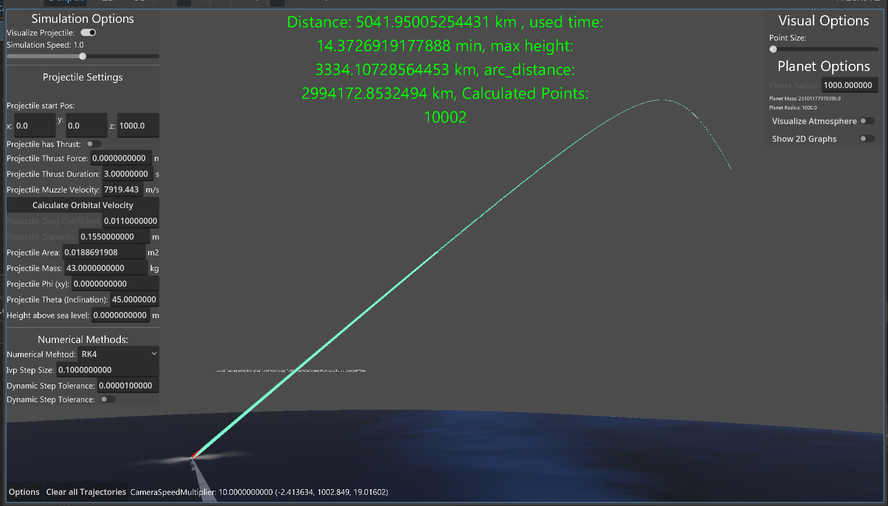

# Advanced 3D Projectile Trajectory Simulator

This is a 3D projectile and rocket trajectory simulator developed in the **Godot Engine**. It was created as a final project for a university course on *Nonlinear Optimization and Differential Equations in Computer Science* and was awarded the highest possible grade.

The project's primary goal is the accurate physical modeling of flight paths by solving a custom system of differential equations, bypassing Godot's built-in physics engine to achieve a higher degree of control and realism for atmospheric flight.



*(It is highly recommended to replace this placeholder image with a screenshot or, even better, a GIF of your simulation in action!)*

---

## Features

- **Realistic Physics Model:** The simulation is governed by a system of Ordinary Differential Equations (ODEs) that account for:
    - **Variable Gravity:** Gravitational force changes with altitude relative to the planet's center.
    - **Atmospheric Drag:** A detailed atmospheric model where air density, temperature, and pressure vary across different atmospheric layers (Troposphere, Stratosphere, etc.).
    - **Mach-Dependent Drag Coefficient:** The projectile's drag coefficient (`Cd`) is not a fixed value but is dynamically sampled from a curve based on its current Mach number, accurately modeling transonic and supersonic effects.
    - **Engine Thrust:** Simulates projectiles with active thrust over a specified duration.
- **Switchable Numerical Solvers:** Implements multiple numerical methods to solve the system of ODEs, allowing for comparison of accuracy and performance:
    - **Runge-Kutta 4th Order (RK4)** (Default and adaptive versions)
    - **Euler Method**
    - **Velocity Verlet**
    - **Symplectic Verlet**
- **Nonlinear Optimization:** Includes an optimization module to solve complex problems, such as finding the optimal launch angle for maximum range using algorithms like:
    - **Gradient Ascent**
    - **Nelder-Mead Method**
- **Comprehensive GUI:** A detailed user interface built with Godot's Control nodes allows for real-time manipulation of dozens of parameters, including:
    - Projectile properties (mass, diameter, thrust force/duration, muzzle velocity).
    - Planet properties (radius, density).
    - Simulation parameters (numerical method, step size, tolerances).
- **Advanced Visualization:**
    - Real-time 3D rendering of the calculated trajectory.
    - Trajectory path is color-coded based on velocity, providing instant visual feedback.
    - Dynamic camera system with a free-look mode and a projectile follow-cam.

---

## Technical Deep Dive

### Core Physics Engine
The simulation deliberately bypasses Godot's standard `RigidBody` physics. This was a crucial design decision to allow for the direct implementation and solution of the flight dynamics equations. The state of the projectile (position `[x, y, z]` and velocity `[vx, vy, vz]`) is represented as a state vector, and its evolution over time is calculated by the numerical solvers.

### The System of Differential Equations
The function `_ode(t, state)` in `numerical_methods.gd` defines the core of the physics model. For any given state, it calculates the rate of change (the derivatives), which is the acceleration vector. This acceleration is the sum of all acting forces divided by the projectile's mass:

`d(state)/dt = [vx, vy, vz, Fx_net/m, Fy_net/m, Fz_net/m]`

Where `F_net` is the vector sum of:
1.  **Gravity (`g`):** A vector pointing towards the planet's center, with magnitude calculated using Newton's law of universal gravitation.
2.  **Drag (`D`):** A vector opposing the velocity vector, calculated with the drag equation `D = 0.5 * ρ * v^2 * Cd * A`. The air density `ρ` and drag coefficient `Cd` are functions of altitude and velocity, respectively.
3.  **Thrust (`T`):** A vector pointing in the direction of the velocity vector (for this implementation).

### Numerical Integration
The `_ivp1_modified` function orchestrates the simulation loop. It repeatedly calls a selected numerical method (like `_rk4b`) to step the simulation forward in time, accumulating the results to form a complete trajectory. An adaptive step-size version of RK4 is also included to dynamically adjust the time step `h` based on the estimated error, ensuring both accuracy and efficiency.

---

## Getting Started

### Prerequisites
- [Godot Engine (version 4.x)](https://godotengine.org/)

### Running the Project
1. Clone this repository:
   ```bash
   git clone https://github.com/your-username/your-repo-name.git
   ```
2. Open the Godot Engine Project Manager.
3. Click "Import" and navigate to the cloned project's `project.godot` file.
4. Once imported, select the project and click "Run" (or press F5).

---

## How to Use

- Use the **"Options"** panel on the left to configure all simulation and projectile parameters.
- Press the **Spacebar** to start the simulation with the current settings.
- Use **WASD** to move the free-look camera, and hold the **right mouse button** to rotate your view.
- Press **F** (configurable) to toggle the projectile follow-camera.
- Click the **"Clear all Trajectories"** button to clear previous flight paths from the screen.
- To run an optimization, press the corresponding key (e.g., `R`) as defined in `main_node.gd`.

---

## License

This project is licensed under the MIT License - see the `LICENSE` file for details.